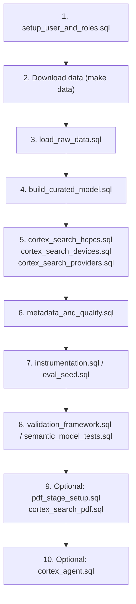

# File Guide

Complete reference for all project files and their purposes.

---

## Documentation

| File | Purpose |
|------|---------|
| `docs/README.md` | Main documentation hub with navigation and guides |
| `docs/FILE_GUIDE.md` | This file - describes all project files |

### Implementation Guides

| File | Purpose |
|------|---------|
| `docs/implementation/getting-started.md` | Step-by-step deployment guide |
| `docs/implementation/data_model.md` | ERD and schema architecture |
| `docs/implementation/snowflake_intelligence_setup.md` | Configure Snowsight UI |

### Reference Documentation

| File | Purpose |
|------|---------|
| `docs/reference/metric_catalog.md` | Business metrics and calculations |
| `docs/reference/agent_guidance.md` | AI agent routing rules and best practices |
| `docs/reference/cortex_agent_creation.md` | Creating Cortex Agents with SQL |
| `docs/reference/embedding_strategy.md` | Semantic search and PDF chunking |
| `docs/reference/pdf_sources.md` | CMS policy document sources |

### Governance

| File | Purpose |
|------|---------|
| `docs/governance/governance_feasibility.md` | Demo-first guidance on what to keep/skip |
| `docs/governance/data_dictionary.md` | Full data dictionary (demo TL;DR included) |
| `docs/governance/semantic_model_lifecycle.md` | Model versioning and management |
| `docs/governance/semantic_model_changelog.md` | Version history and migrations |
| `docs/governance/semantic_publish_checklist.md` | Pre-publish validation |
| `docs/governance/human_validation_log.md` | Testing and validation framework |

### Diagrams

| File | Purpose |
|------|---------|
| `docs/diagrams/datamodel.png` | Entity-relationship diagram |
| `docs/diagrams/cortex-search-rag.png` | Search + RAG architecture |

> Note: This repo does not keep a `docs/archive/` folder. Use `git log -- docs/` to browse older doc versions.

---

## SQL Scripts

### Setup & Infrastructure

| File | Purpose | When to Run |
|------|---------|------------|
| `sql/setup/setup_user_and_roles.sql` | Create role, warehouse, DB, schemas, and base grants | During initial setup |
| `sql/setup/apply_grants.sql` | Post-creation grants for views/search/stage | After objects exist |
| `sql/setup/pdf_stage_setup.sql` | Optional: stage + load PDF sources | Before `make search-pdf` |
| `sql/setup/pdf_search_validation.sql` | Optional: validate PDF search coverage | After `make search-pdf` |

### Data Ingestion

| File | Purpose | When to Run |
|------|---------|------------|
| `sql/ingestion/load_raw_data.sql` | Load CMS/FDA data from stages | After `make data` download |

### Transform (Curated + Analytics)

| File | Purpose | When to Run |
|------|---------|------------|
| `sql/transform/build_curated_model.sql` | Build curated tables and analytics views | During `make model` |

### Cortex Search Services

| File | Purpose | When to Run |
|------|---------|------------|
| `sql/search/cortex_search_hcpcs.sql` | HCPCS code search service | During `make search` |
| `sql/search/cortex_search_devices.sql` | Device catalog search service | During `make search` |
| `sql/search/cortex_search_providers.sql` | Provider directory search service | During `make search` |
| `sql/search/cortex_search_pdf.sql` | PDF policy document search service | During `make search` (after uploading PDFs) |

### Governance & Monitoring

| File | Purpose | When to Run |
|------|---------|------------|
| `sql/governance/metadata_demo.sql` | Demo: minimal metadata + sensitivity policy | During `make governance-demo` |
| `sql/governance/profile_demo.sql` | Demo: lightweight profiling | During `make governance-demo` |
| `sql/governance/metadata_and_quality.sql` | Full metadata + quality scaffolding | During `make metadata` |
| `sql/governance/run_profiling.sql` | Full profiling run | During `make profile` |

### PDF Search Setup

| File | Purpose | When to Run |
|------|---------|------------|
| `sql/setup/pdf_stage_setup.sql` | Create PDF stage and upload PDFs | Before `make search` (if using PDFs) |
| `sql/setup/pdf_search_validation.sql` | Test PDF search service | After creating PDF search service |

### Agent Creation

| File | Purpose | When to Run |
|------|---------|------------|
| `sql/agent/cortex_agent.sql` | Create multi-tool Cortex Agent | Optional, after all search services ready |

---

## Python Scripts

| File | Purpose | When to Run |
|------|---------|------------|
| `data/dmepos_referring_provider_download.py` | Download CMS DMEPOS claims data | During `make data` or as needed |

---

## Configuration Files

| File | Purpose |
|------|---------|
| `models/DMEPOS_SEMANTIC_MODEL.yaml` | Semantic model definition for Cortex Analyst |
| `.claude/settings.local.json` | Claude Code permissions configuration |
| `.claudeignore` | Files to exclude from Claude context |
| `Makefile` | Build targets for deployment steps |
| `CLAUDE.md` | Project-specific instructions for Claude |
| `AGENTS.md` | Agent-related instructions |

---

## Data Directory

| File/Folder | Purpose |
|-------------|---------|
| `data/README.md` | Data download instructions |
| `data/dmepos_referring_provider_download.py` | CMS data download script |
| `data/data_download.sh` | FDA GUDID data download script |
| `data/dmepos_referring_provider.json` | Downloaded CMS claims (git ignored) |
| `data/gudid_delimited/` | Extracted FDA device catalog (git ignored) |

---

## Project Organization

```
snowflake-intelligence-medicare-pos-analyst/
├── docs/
│   ├── README.md (main docs hub)
│   ├── FILE_GUIDE.md (this file)
│   ├── implementation/ (deployment guides)
│   ├── reference/ (technical docs)
│   ├── governance/ (versioning & QA)
│   ├── diagrams/ (architecture images)
│
├── sql/
│   ├── setup/ (initialization scripts)
│   ├── ingestion/ (data loading)
│   ├── transform/ (curated tables + analytics views)
│   ├── search/ (Cortex Search services)
│   ├── intelligence/ (instrumentation, evals, validation, tests)
│   ├── governance/ (metadata, lineage, data quality)
│   └── agent/ (Cortex Agent creation)
│
├── models/
│   └── DMEPOS_SEMANTIC_MODEL.yaml (semantic model definition)
│
├── data/
│   ├── README.md (download instructions)
│   ├── dmepos_referring_provider_download.py
│   └── data_download.sh
│
├── medium/ (blog articles)
│
├── Makefile (build automation)
├── CLAUDE.md (project instructions)
├── README.md (project overview)
└── .gitignore
```

---

## SQL Execution Order (Typical Flow)



---

## Key Files by Use Case

### "I need to deploy the full project"
- `docs/implementation/getting-started.md`
- `Makefile` (targets: `make demo`, `make data`, `make setup`, etc.)
- `sql/setup/*.sql` (run in order)

### "I need to understand the data model"
- `docs/implementation/data_model.md`
- `docs/diagrams/datamodel.png`
- `sql/transform/build_curated_model.sql` (see table/view definitions)

### "I need to create a Cortex Agent"
- `docs/reference/cortex_agent_creation.md`
- `sql/agent/cortex_agent.sql` (reference implementation)
- `docs/reference/agent_guidance.md` (routing rules)

### "I need to implement PDF search"
- `docs/reference/embedding_strategy.md` (PDF chunking)
- `sql/setup/pdf_stage_setup.sql` (upload PDFs)
- `sql/search/cortex_search_pdf.sql` (create search service)
- `sql/setup/pdf_search_validation.sql` (test)

### "I need to add metrics"
- `docs/reference/metric_catalog.md` (existing metrics)
- `models/DMEPOS_SEMANTIC_MODEL.yaml` (add metric definition)
- `docs/governance/semantic_publish_checklist.md` (validation)

---

## Git Ignore

Files NOT checked into git (intentionally):

```
data/dmepos_referring_provider.json     # Downloaded claims data
data/gudid_delimited/                  # Extracted FDA catalog
data/*.zip                             # Compressed archives
pdf/                                   # CMS PDF documents
scratch/                               # Temporary files
backup/                                # Backup files
```

These are excluded because they are:
- **Large** (100+ MB each)
- **Sourced from external APIs** (no need to version)
- **Local temporary files** (not part of the codebase)

Download them using the provided scripts before deployment.

---

## Related Documentation

- [Main README](README.md) - Project overview
- [Getting Started](implementation/getting-started.md) - Deployment guide
- [Makefile targets](../Makefile) - Build automation
