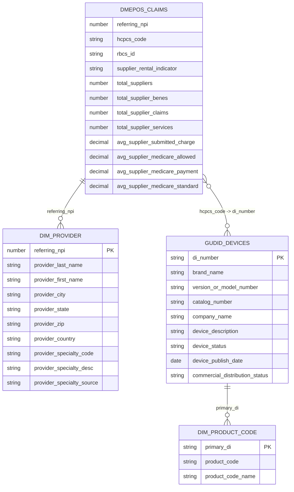

# Data Model Diagram

This diagram reflects the current curated model in `scripts/step_4_data_model.sql`.

## Notes

- `DMEPOS_CLAIMS` is the curated claims table at provider + HCPCS grain.
- `DIM_PROVIDER` is derived from `DMEPOS_CLAIMS`.
- `GUDID_DEVICES` is the curated device table keyed by DI.
- `DIM_PRODUCT_CODE` is derived from GUDID product code data.
- The `hcpcs_code -> di_number` join is a demo-friendly link, not a strict key match.
