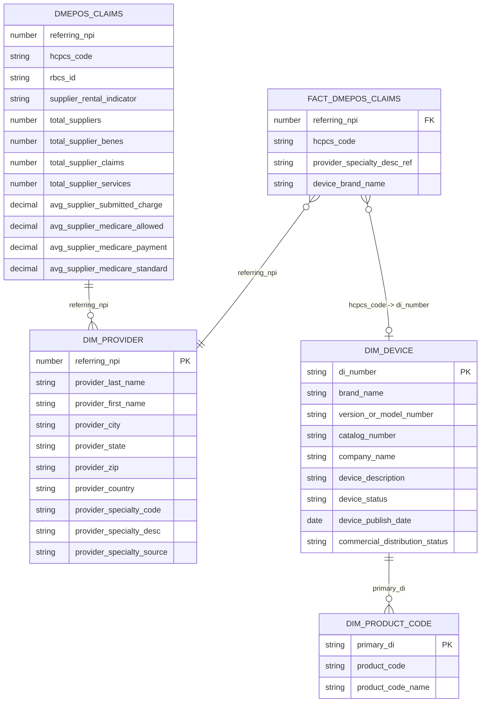

# Data Model Diagram

This diagram reflects the current model in `sql/transform/build_curated_model.sql`.
---

## Navigation

| Want This | See This |
|-----------|----------|
| 📖 **Foundation Layer Architecture** | [Subarticle 2: The Foundation Layer](../../medium/claude/subarticle_2_foundation_layer.md) |
| 💾 **Star Schema SQL** | [Build Curated Model](../../sql/transform/build_curated_model.sql) |
| 📚 **Deployment Instructions** | [Getting Started](getting-started.md) |

---

## Schema Architecture (Medallion)

| Schema | Layer | Contents |
|--------|-------|----------|
| RAW | Bronze | RAW_DMEPOS, RAW_GUDID_DEVICE, RAW_GUDID_PRODUCT_CODES |
| CURATED | Silver | DMEPOS_CLAIMS, GUDID_DEVICES |
| ANALYTICS | Gold | DIM_PROVIDER, DIM_DEVICE, DIM_PRODUCT_CODE, FACT_DMEPOS_CLAIMS |
| SEARCH | - | Cortex Search services |
| INTELLIGENCE | - | Eval sets, query logging, validation |
| GOVERNANCE | - | Metadata, lineage, quality checks |
> **📖 See Medium:** Learn how to design data architecture for AI workloads in [Subarticle 2: The Foundation Layer](../../medium/claude/subarticle_2_foundation_layer.md)

## Entity Relationship Diagram

## Table Details

### CURATED Layer (Silver)

| Table | Description | Source |
|-------|-------------|--------|
| `CURATED.DMEPOS_CLAIMS` | Curated claims at provider + HCPCS grain | RAW.RAW_DMEPOS |
| `CURATED.GUDID_DEVICES` | Curated device catalog | RAW.RAW_GUDID_DEVICE |

> **💾 See SQL:** Implementation details in [build_curated_model.sql](../../sql/transform/build_curated_model.sql)

### ANALYTICS Layer (Gold)

| View | Description | Source |
|------|-------------|--------|
| `ANALYTICS.DIM_PROVIDER` | Provider dimension (distinct providers) | CURATED.DMEPOS_CLAIMS |
| `ANALYTICS.DIM_DEVICE` | Device dimension | CURATED.GUDID_DEVICES |
| `ANALYTICS.DIM_PRODUCT_CODE` | Product code dimension | RAW.RAW_GUDID_PRODUCT_CODES |
| `ANALYTICS.FACT_DMEPOS_CLAIMS` | Enriched fact view (joins provider + device) | CURATED.DMEPOS_CLAIMS |

> **💾 See SQL:** Star schema fact and dimension queries in [build_curated_model.sql](../../sql/transform/build_curated_model.sql)

## Notes

- `DMEPOS_CLAIMS` is the curated claims table at provider + HCPCS grain.
- `DIM_PROVIDER` is derived from `DMEPOS_CLAIMS` (distinct providers).
- `DIM_DEVICE` is derived from `GUDID_DEVICES`.
- `DIM_PRODUCT_CODE` is derived from GUDID product code data.
- `FACT_DMEPOS_CLAIMS` enriches claims with provider and device attributes.
- The `hcpcs_code -> di_number` join is a demo-friendly link, not a strict key match.
